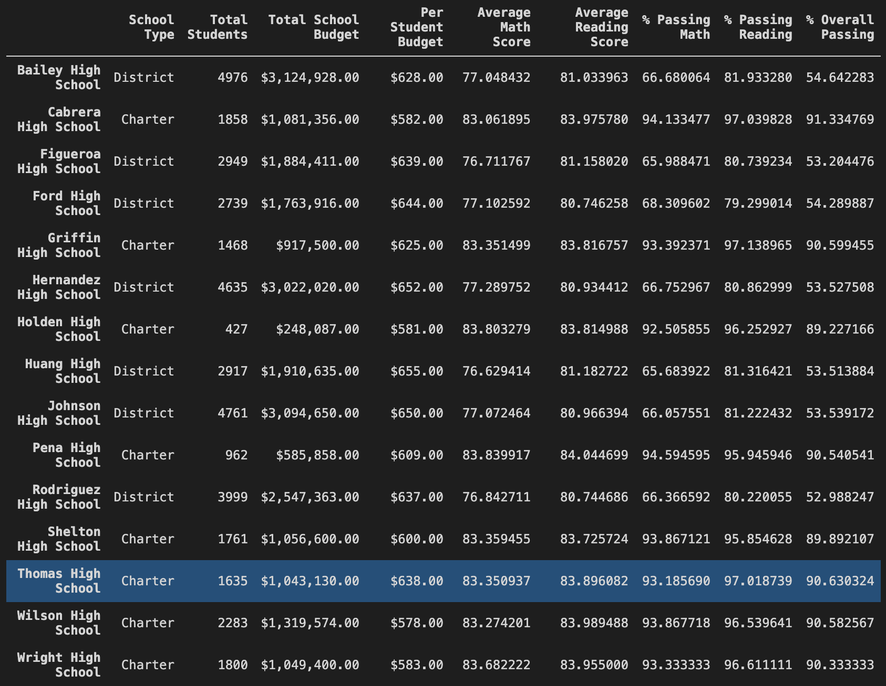

# school_district_analysis

## Overview of Project

The purpose of this project is to re-analyze the student funding and student standardize test scores due to evidence of academic dishonesty; specifically, reading and math grades for Thomas High School ninth graders. This analysis will be used to inform discussions and strategic decisions at the school and district level. 

The various data provided will be analyzed and presented to provide insights about performance, trends and patterns. 

## School District Analysis Results

The data preparation utilizes Pandas and Jupyter to perform calculations and analysis by creating DataFrames and various functions to explore the data. This helped to create multiple DataFrames to use for future analysis. Insight are generated on the <a href="PyCitySchools_Challenge.ipynb">PyCitySchools script</a>. 

### District Summary

**How is the district summary affected?**

After altering the data to disregard the reading and math grades from Thomas High School ninth graders, the overall district summary was only slightly affected. 

- Average Math Score: The scores moved from 79.0% to 78.9% (0.1% change).
- Average Reading Score: The scores did not change.
- % Passing Math: The scores moved from 75.0% to 74.8%.
- % Passing Reading: The scores moved from 85.8% to 85.7%.
- % Overall Passing: The scores moved from 65.2% to 64.9%.

This is the original data:

This is the altered data:

The Average Math Score, % Passing Math, % Passing Reading and % Overall Passing decreased by 0.1% to 0.3%. Whereas the Average Reading Score was not affected. 

### School Level Summary

**How is the school summary affected?**

All school data remained the same except for Thomas High School. The Average Math Scores and Average Reading Scores are barely effected and only change by ~0.1%.

The % Passing Math, % Passing Reading and % Overall Passing are also barely effected and only changing by 0.1-0.3%

This is the original data:

This is the altered data:

**How does replacing the ninth graders’ math and reading scores affect Thomas High School’s performance relative to the other schools?**

In the original and new dataset based on the % Overall Passing score, Thomas High School was ranked 2nd out of the 15 schools.

In the original dataset, the % Overall Passing score was 90.95%, whereas in the new dataseet, the score was 90.63%. 

This pushes Thomas High School closer to the 3rd-5th place schools, that all range from 90.54% to 90.60%.

**How does replacing the ninth-grade scores affect the following:**
**1. Math and reading scores by grade**
On the math and reading scores by grade DataFrames, the only difference is that Thomas High School ninth grader scores do not have a value. All other data from other schools and grades remain the same. 

**2. Scores by school spending**
There is no change in the scores by school spending. 

**3. Scores by school size**
There is no change in the scores by the school size. 

**4. Scores by school type**
There is no change in the scores by school type. 

## Summary

After completing the analysis, these are the four major changes in the updated school district analysis after the reading and math scores for the ninth grade at Thomas High School have been replaced: 

1. 