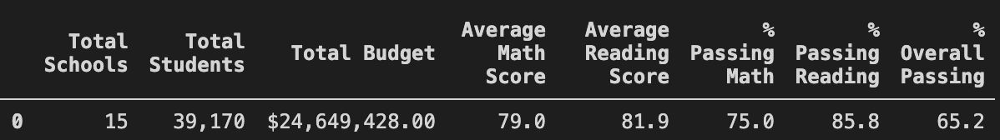
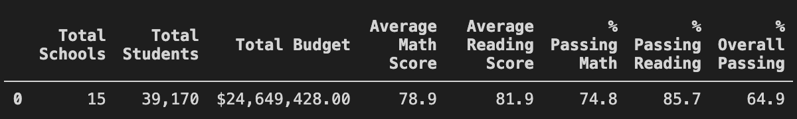
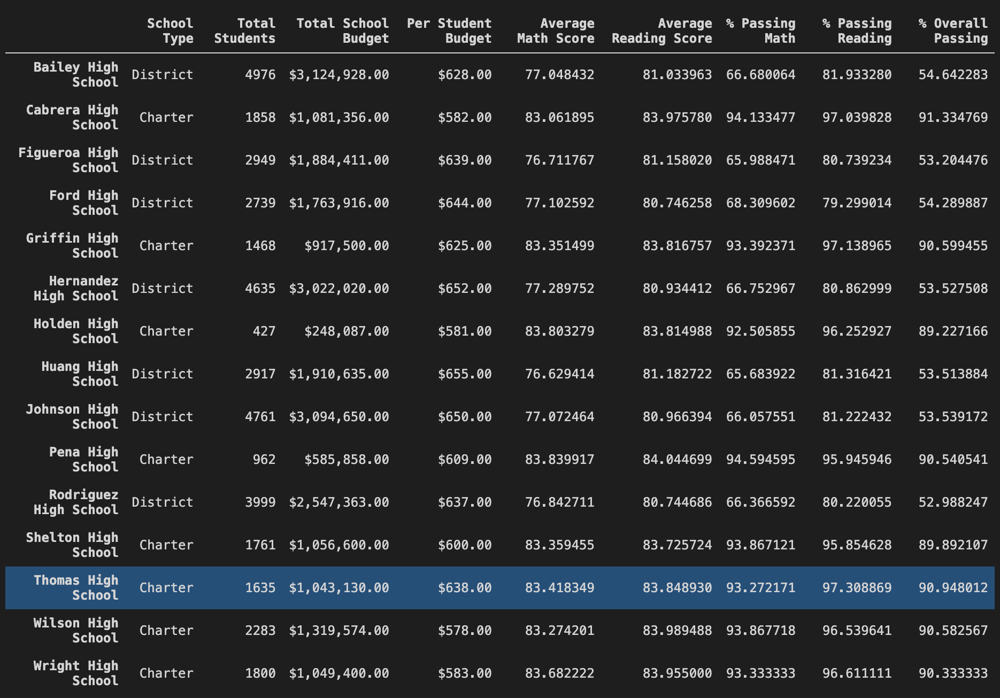
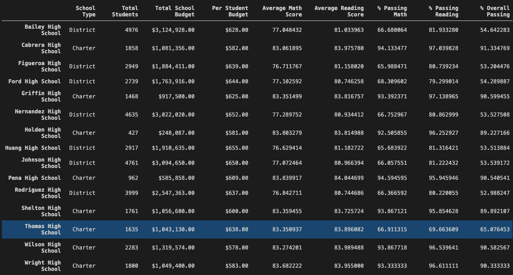
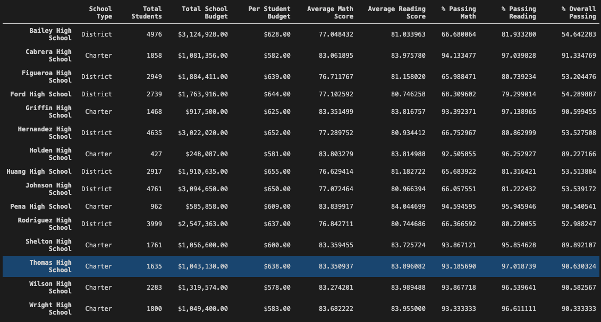

# school_district_analysis

## Overview of Project

The purpose of this project is to re-analyze the student funding and student standardize test scores due to evidence of academic dishonesty; specifically, reading and math grades for Thomas High School ninth graders. This analysis will be used to inform discussions and strategic decisions at the school and district level. 

The data provided will be analyzed and presented to provide insights about performance, trends and patterns in comparison to the <a href="Resources/PyCitySchools.ipynb">original PyCitySchool analysis</a>. 

## School District Analysis Results

The data preparation utilizes Pandas and Jupyter to perform calculations and analysis by creating DataFrames and various functions to explore the data. This create multiple DataFrames to use for future analysis. Insight are generated on the <a href="PyCitySchools_Challenge.ipynb">new PyCitySchools analysis</a>. 

### District Summary

After altering the data to disregard the reading and math grades from Thomas High School ninth graders, the overall district summary was only slightly affected. 

- **Average Math Score:** The scores moved from 79.0% to 78.9% (-0.1% change).
- **Average Reading Score:** The scores did not change.
- **% Passing Math:** The scores moved from 75.0% to 74.8% (-0.2% change).
- **% Passing Reading:** The scores moved from 85.8% to 85.7% (-0.1% change).
- **% Overall Passing:** The scores moved from 65.2% to 64.9% (-0.3% change).

This is the original data:

This is the altered data:

### School Level Summary

All school data remained the same except for Thomas High School. For this analysis, we will only be focusing on Thomas High School, since the other schools are not effected. 

After adjusting the scores to alter the ninth grade data, this is how Thomas High School's school performance was:
- **Average Math Score:** The scores moved from 83.42% to 83.35% (-0.07% change).
- **Average Reading Score:** The scores moved from 83.85% to 83.89% (+0.04% change).
- **% Passing Math:** The scores moved from 83.27% to 66.91% (-16.36% change).
- **% Passing Reading:** The scores moved from 97.30% to 69.66% (-27.64% change).
- **% Overall Passing:** The scores moved from 90.95 to 65.08% (-25.87% change).

Then after adjusting the DataFrame to only consider the upper year students (grade 10, 11, 12), this is the results:
- **Average Math Score:** The scores moved from 83.42% to 83.35% (-0.07% change).
- **Average Reading Score:** The scores moved from 83.85% to 83.89% (+0.04% change).
- **% Passing Math:** The scores moved from 83.27% to 93.19% (+9.92% change).
- **% Passing Reading:** The scores moved from 97.30% to 97.02% (-0.28 change).
- **% Overall Passing:** The scores moved from 90.95 to 90.63% (-0.32% change).

This is the original data:

This is the altered data including students from grade 9-12:

This is the altered data including students from only grade 10-12:

### Performance Analysis

**How does replacing the ninth graders’ math and reading scores affect Thomas High School’s performance relative to the other schools?**

In the original and new dataset based on the % Overall Passing score, Thomas High School was ranked 2nd out of the 15 schools.

In the original dataset, the % Overall Passing score was 90.95%, whereas in the new dataseet, the score was 90.63%. 

This pushes Thomas High School closer to the 3rd-5th place schools, that all range from 90.54% to 90.60%.

**How does replacing the ninth-grade scores affect the following:**

1. **Math and Reading Scores by Grade**
    
    On the math and reading scores by grade DataFrames, the only difference is that Thomas High School ninth grader math and reading scores do not have a value. All other data from other schools and grades remain the same. 

2. **Scores by School Spending**

    There is no change in the scores by school spending. 

3. **Scores by School Size**

    There is no change in the scores by the school size. 

4. **Scores by School Type**

    There is no change in the scores by school type. 

## Summary

After completing the analysis, these are the four major changes in the updated school district analysis after the reading and math scores for the ninth grade at Thomas High School have been replaced: 

1. The District Summary had very little change in their results, with only 0.1-0.3% changes. This is due to the huge sample size of 39,170 students and only 461 of them being altered.

2. The ninth graders altered data significantly impacted the results for the Thomas High School's school summary, specifically the % Passing Math, % Passing Rading and % Overall Passing, where the grades were lowered by approximately 16-27%.

3. When looking at the data of just the upper year students (grade 10, 11, 12) for Thomas High School's school summary, the grades barely change and actually improved for the % Passing Math, where the grades increased by almost 10%. 

4. Replacing the ninth grade scores barely had any effect or no effect on the school rankings, as well as the scores by school spending, school size and school type.  